# Monodepth2 training with roll angles:

## Cloning the repository:

The entire repository can be cloned with submodules using
```
git clone https://github.com/shyam573/Training-mono_roll
git submodule init
git submodule update
```

## Executing the code:

This procedure removes the actual folder of KITTI dataset. The operations are performed on the current KITTI folder.

- KITTI like folder structure can be created without images can be created by running the command below. This creates a folder structure just like KITTI format by also copying the .bin and .txt files from velodyne and oxts folders.
```
python create_tree.py
```

- Images with roll angles with the method mentioned in section below can be created running the following command:
```
python create_images.py
```

- Training can be performed by executing the following command:
```
python monodepth2/train.py --model_name mono_model --png
```

- Results for all the models can be checked using:
```
python inference.py
```

## Method used:

- Roll angles are varied in between a range of -30 degrees and 30 degrees with a uniform distribution.

- The random degrees that are selected for increment or decrement is in between 0.08 and 0.14 with uniform distribution.

- For a sequence of images, when a random angle is generated, angles are incremented or decremented with random degrees for each image processed only once.

- Increment or decrement of angles is continued in steps of random degrees till the random angle is obtained and then vice versa is performed in steps of random degrees till zero is obtained.

- For a new image sequence, the roll angle again starts from zero.

- Random angle is generated again and the above steps are repeated for all image sequences.

- This entire procedure is offline. The zoom factor suitable for this approach is 1.75. Zoom factor is obtained based on trial and error method such that remove all black pixels at edges are removed, hence the image is corrected. The flag used of rotation is `cv2.INTER_LANCZOS4` and for resizing is `cv2.INTER_LINEAR`.

## KITTI Benchmark - Depth Results:

All the evaluations are done using median scaling on KITTI dataset.

| --model_name | abs_rel | sq_rel | rmse | rmse_log | delta<1.25 (a1)| delta<1.25<sup>2</sup> (a2) | delta<1.25<sup>3</sup> (a3) |
| --- | --- | --- | --- | --- | --- | --- | --- |
| mono_640x192_original         | 0.115 | 0.903 | 4.863 | 0.193 | 0.877 | 0.959 | 0.981 |
| mono_1024x320_original        | 0.115 | 0.882 | 4.701 | 0.190 | 0.879 | 0.961 | 0.982 |
| mono_640x192_no_roll          | 0.117 | 0.902 | 4.897 | 0.194 | 0.872 | 0.958 | 0.981 |
| mono+stereo_640x192_no_roll   | 0.108 | 0.820 | 4.693 | 0.188 | 0.884 | 0.961 | 0.981 |
| **mono_640x192_roll**         | **0.146** | **0.995** | **5.592** | **0.225** | **0.800** | **0.942** | **0.977** |
| **mono+640x192_crop_and adjusted_intrinsics** | **0.166** | **1.540** | **6.742** | **0.261** | **0.761** | **0.914** | **0.962** |
| **mono+640x192_no_crop**      | **0.120** | **0.886** | **4.860** | **0.197** | **0.869** | **0.958** | **0.981** |

## Inference results:

The results are not satisfactory.


#### No angle:

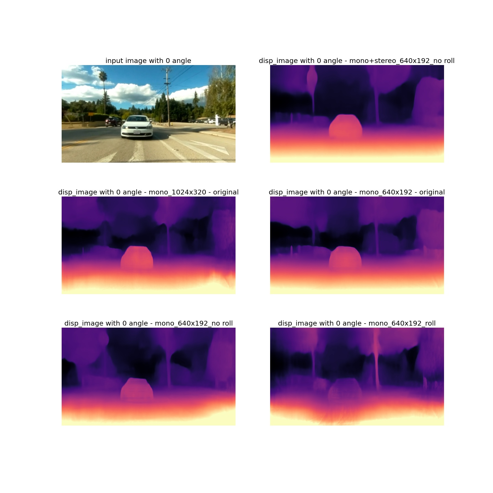

#### +5 degrees:

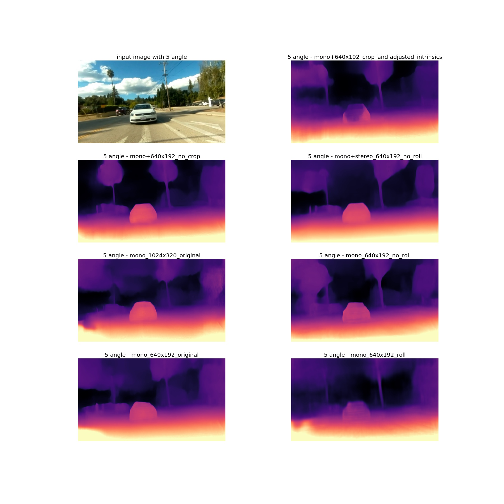

#### +10 degrees:

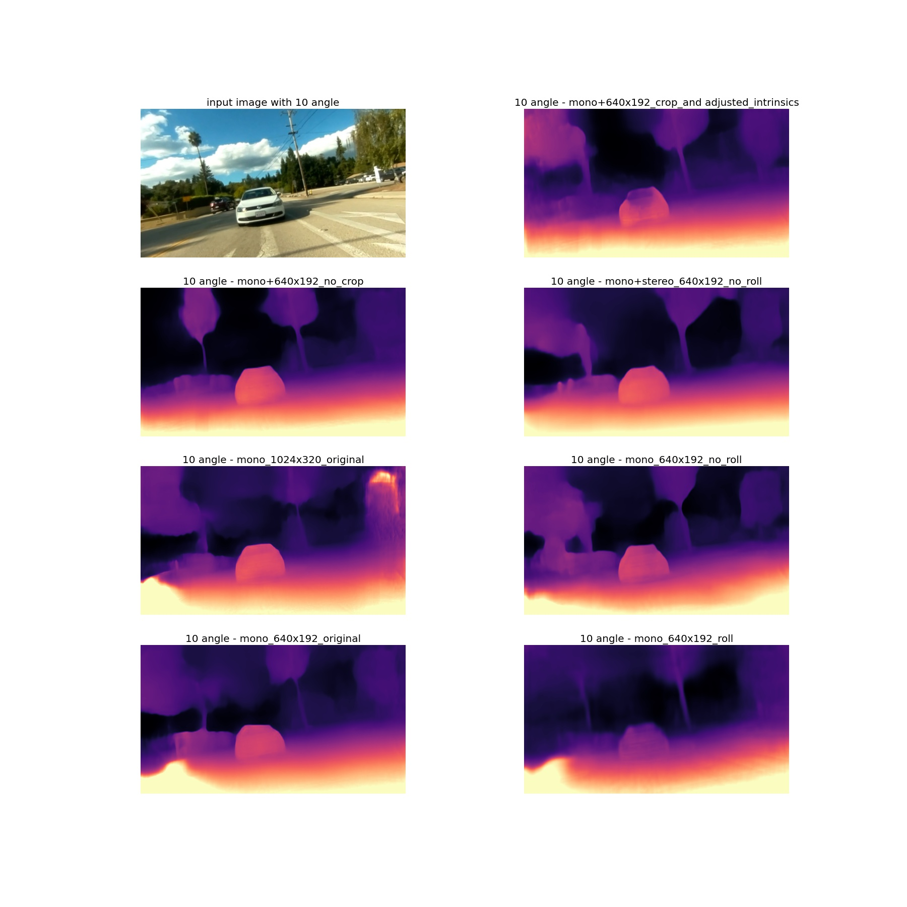

#### +15 degrees:

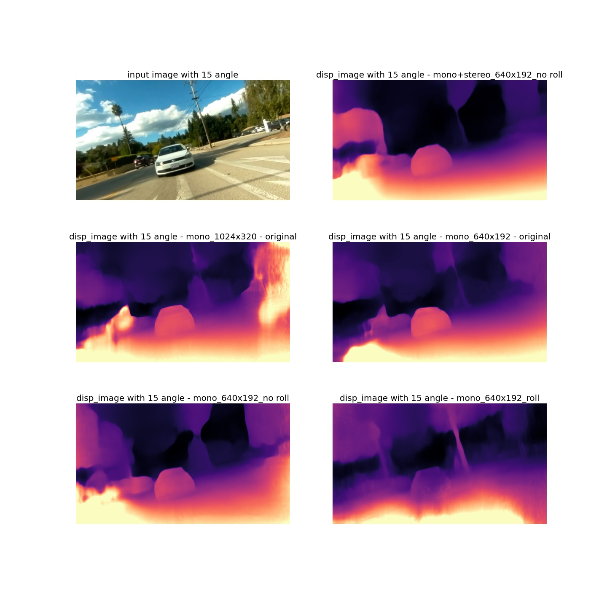


#### +30 degrees:

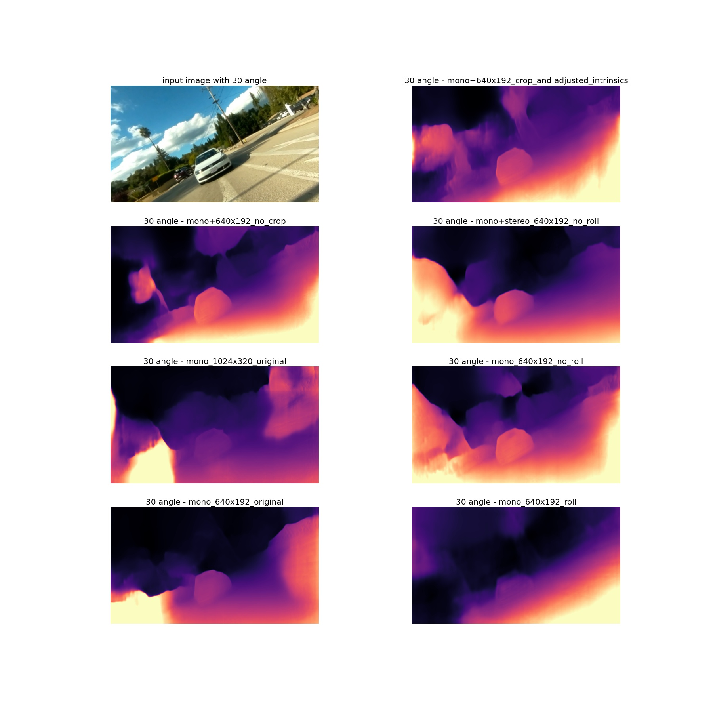


#### -5 degrees:

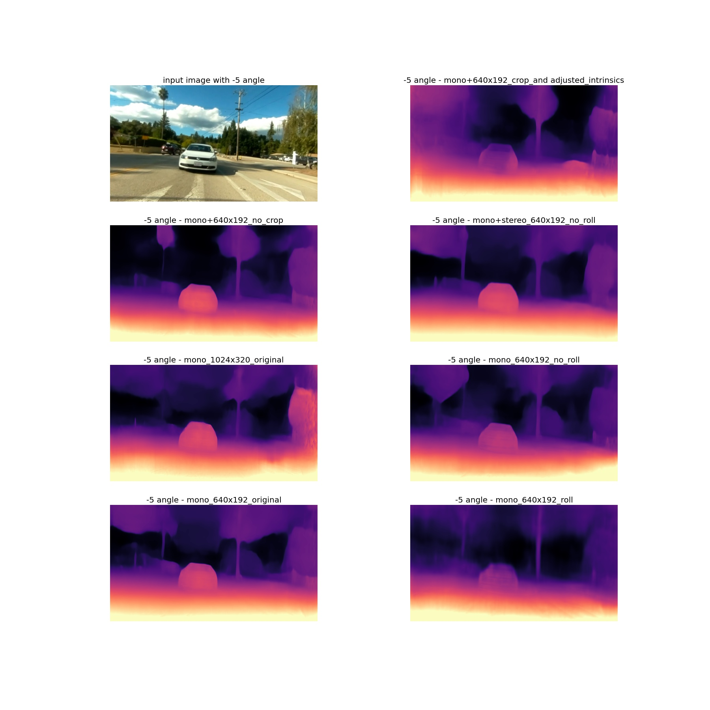


#### -10 degrees:

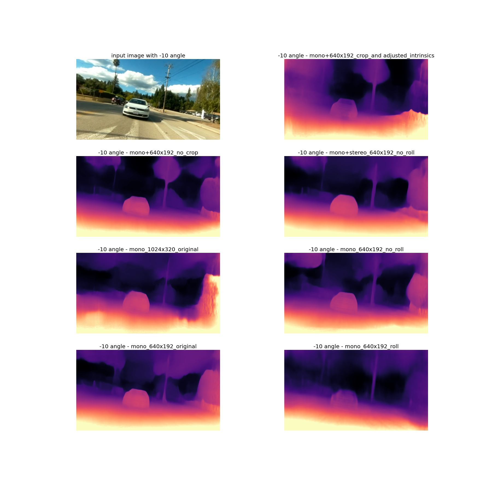


## Pose evaluation:

#### KITTI data without roll:

##### Input images:
Frame_0            |  Frame_10
:-------------------------:|:-------------------------:
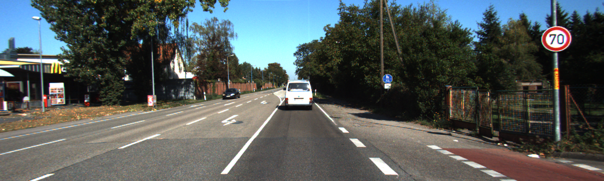  |  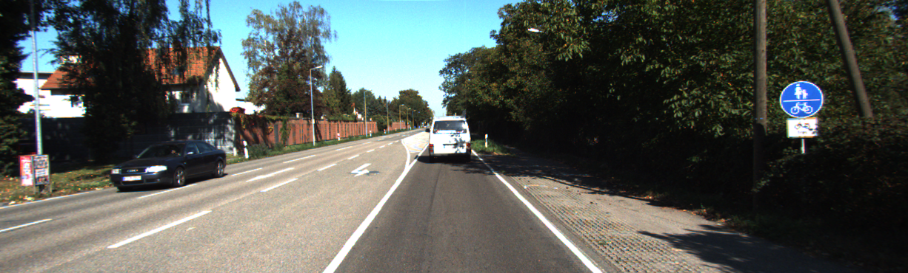


| --model_name                  | axis angle | translation |
| --- | --- | --- |
| mono_640x192_no_roll          | [[[[ 0.00134899  0.03647101  0.00547983]] [[-0.00774672  0.00689836  0.00314651]]]] | [[[[ 0.00068562  0.00036362 -0.01349872]] [[ 0.00383579 -0.00174567 -0.00165081]]]] |
| mono_640x192_original         | [[[[ 0.00012172  0.04322237  0.00320075]] [[-0.0009301  -0.00036185  0.00206916]]]]  | [[[[ 0.00160648  0.00020703 -0.00807989]] [[-0.00482472 -0.00229553 -0.00358354]]]] |
| mono_640x192_roll             | [[[[ 7.8747940e-04  5.2153442e-02  3.1000387e-03]] [[-3.5047283e-06 -8.8263294e-03 -7.9538258e-05]]]]  | [[[[ 0.00147695  0.00050621 -0.01870887]] [[-0.00530112  0.01004219 -0.00631648]]]] |
| mono_1024x320_original        | [[[[1.1611780e-05 1.3803337e-02 4.5586973e-03]] [[8.2102133e-04 9.4100440e-05 8.3001639e-04]]]] | [[[[ 1.1375237e-05 -2.8613798e-04  2.0250571e-03]] [[-1.9613483e-03 -2.7487037e-04 -1.2174805e-03]]]] |
| mono+640x192_crop_and adjusted_intrinsics        | [[[[ 0.00100486  0.04121669  0.00571863]] [[-0.00470508 -0.00344181 -0.0014638 ]]]] | [[[[ 0.00102394  0.00013476 -0.00211083]] [[-0.00533578 -0.00131838  0.001426  ]]]] |
| mono+640x192_no_crop | [[[[ 0.00036792  0.0346928   0.0043105 ]] [[ 0.0017268   0.01561817 -0.01379992]]]]  | [[[[ 0.00306976  0.00113912 -0.06029485]] [[-0.00319922  0.00129591 -0.01174447]]]] |
| mono+stereo_640x192_no_roll      | [[[[ 0.00032702  0.0028376  -0.00187543]] [[-0.00672339  0.00568781  0.00766256]]]] | [[[[ 0.00053792  0.00076486 -0.05717466]] [[ 0.00302625 -0.00011768  0.00085179]]]] |


#### KITTI data with roll:

Frame_0            |  Frame_10
:-------------------------:|:-------------------------:
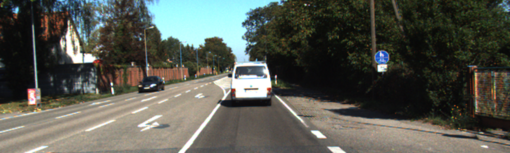  |  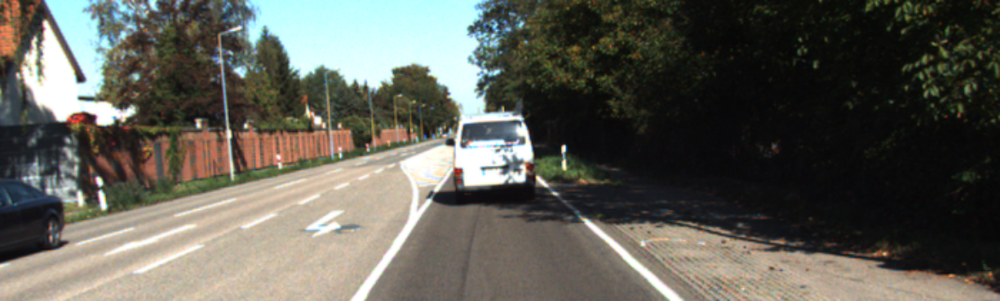

| --model_name                  | axis angle | translation |
| --- | --- | --- |
| mono_640x192_no_roll          | [[[[ 0.00728744  0.00106746 -0.00520063]] [[-0.00322976  0.00740163  0.00878016]]]]  | [[[[ 0.00124007  0.00078411 -0.04481828]] [[ 0.00239687  0.00029508 -0.00011296]]]] |
| mono_640x192_original         | [[[[ 0.00445435  0.00067883 -0.00376851]] [[ 0.00281886  0.00014292  0.00143521]]]]  | [[[[ 2.0593926e-03  5.9843867e-04 -4.5199975e-02]] [[ 3.5944282e-05 -2.1570239e-03  2.1252770e-04]]]] |
| mono_640x192_roll             | [[[[ 0.00448418 -0.0342516  -0.0026397 ]] [[-0.00924    -0.02129632  0.00076043]]]]  | [[[[-0.00308903  0.00079387 -0.02370519]] [[ 0.01330386  0.00162566 -0.01314305]]]] |
| mono_1024x320_original        | [[[[ 0.00270717 -0.00431579 -0.00789273]] [[ 0.00181455  0.00062207  0.00094025]]]]  | [[[[ 9.5329963e-04 -1.9483448e-05 -1.7933989e-02]] [[ 1.0520169e-03 -6.6787860e-04 -3.4925943e-05]]]] |
| mono+640x192_crop_and adjusted_intrinsics        | [[[[ 0.00886186 -0.00788227 -0.01050381]] [[ 0.00759645 -0.01228975 -0.00436501]]]]  | [[[[-0.02475407 -0.00672459 -0.0402808 ]] [[ 0.00582408  0.00386715 -0.00672717]]]] |
| mono+640x192_no_crop | [[[[ 0.00665126  0.00229863 -0.00854432]] [[-0.00214099  0.00639689  0.00334335]]]]   | [[[[ 0.00017955  0.00054971 -0.04360052]] [[-0.00229242  0.00083296 -0.00201386]]]] |
| mono+stereo_640x192_no_roll      | [[[[ 0.00655371 -0.00302104 -0.00490357]] [[ 0.01817443  0.01174646  0.00278738]]]] | [[[[ 0.00473535  0.00483456 -0.23759145]] [[-0.00314006  0.00158418 -0.00561508]]]] |
