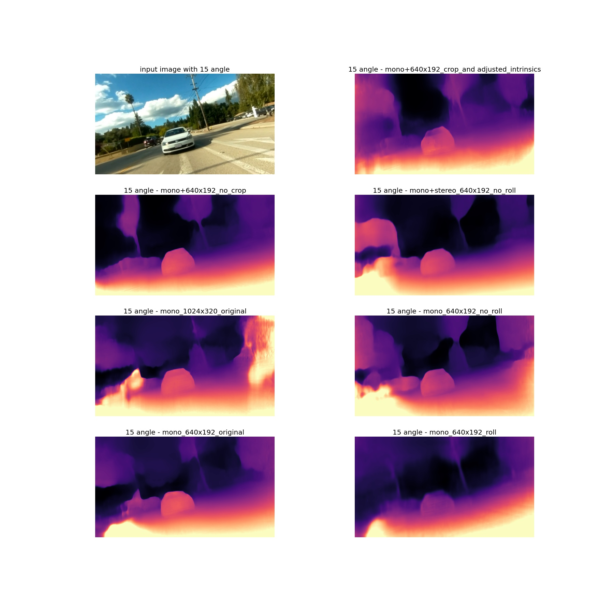

# Monodepth2 training with roll angles:

## Procedure:

- Roll angles are varied in between a range of -30 degrees and 30 degrees with a uniform distribution.

- The random degrees that are selected for increment or decrement is in between 0.08 and 0.14 with uniform distribution.

- For a sequence of images, when a random angle is generated, angles are incremented or decremented with random degrees for each image processed only once.

- Increment or decrement of angles is continued in steps of random degrees till the random angle is obtained and then vice versa is performed in steps of random degrees till zero is obtained.

- For a new image sequence, the roll angle again starts from zero.

- Random angle is generated again and the above steps are repeated for all image sequences.

- This entire procedure is offline. The zoom factor suitable for this approach is 1.75. Zoom factor is obtained based on trial and error method such that remove all black pixels at edges are removed, hence the image is corrected. The flag used of rotation is `cv2.INTER_LANCZOS4` and for resizing is `cv2.INTER_LINEAR`.

## KITTI Benchmark:

All the evaluations are done using median scaling on KITTI dataset.

| --model_name | abs_rel | sq_rel | rmse | rmse_log | delta<1.25 (a1)| delta<1.252 (a2) | delta<1.253 (a3) |
| --- | --- | --- | --- | --- | --- | --- | --- |
| mono_640x192_epoch19_roll   | 0.336 | 4.041 | 9.071 | 0.426 | 0.487 | 0.748 | 0.875 |
| mono_640x192_epoch20_roll   | 0.337 | 4.068 | 9.099 | 0.426 | 0.490 | 0.747 | 0.873 |
| mono+stereo_640x192_no roll | 0.282 | 2.897 | 8.169 | 0.383 | 0.557 | 0.801 | 0.906 |
| mono_640x192 - original     | 0.282 | 3.007 | 8.235 | 0.379 | 0.565 | 0.806 | 0.908 |
| mono_1024x320 - original    | 0.282 | 8.158 | 0.384 | 0.559 | 0.487 | 0.800 | 0.906 |

## Inference results:

The results are not satisfactory. The training log is shown [here](https://github.com/shyam573/Training-mono_roll/blob/master/train_log.md).

#### No angle:

#### +5 degrees:

#### +10 degrees:

#### +15 degrees:

#### +30 degrees:

#### -5 degrees:

#### -10 degrees:

